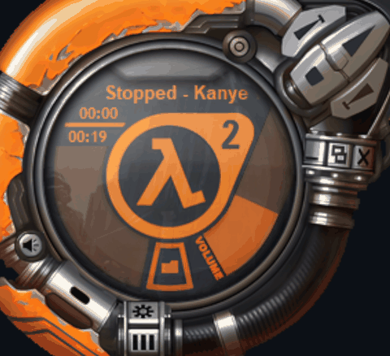

# Half-Life 2 WMP Skin Remastered

A remastered version of the classic Half-Life 2 Windows Media Player skin with AI-upscaled textures, enhanced audio, and a resizable Info panel.



## [Download v1.4.3](hl2_wmp_skin_remastered_v1.4.3_final.wmz?raw=true)

Double-click to install.

## Features

- **AI-Upscaled Textures**: Every texture, button, frame, and UI element enhanced using Real-ESRGAN 4x
- **Resizable Info Panel**: Click and drag to resize the "Half-Life 2 Information" panel (100%-150%, aspect-ratio locked)
- **Enhanced Audio**: Shutter sound effects cleaned up with high-pass filter, subtle clarity boost, and balanced volume
- **Smoother Animations**: Interpolated shutter animation (9 → 17 frames) with 50ms timing
- **60 FPS UI**: Updated timer intervals for fluid interface response
- **Preserved Functionality**: All original features work - shutter animations, transport controls, volume/seek sliders, visualizations

## Installation

1. Download the `.wmz` file above
2. Double-click to install, or copy to:
   ```
   C:\Program Files (x86)\Windows Media Player\Skins\
   ```
3. Open Windows Media Player → View → Skin Chooser → Select "Half-Life 2"

## Requirements

- Windows Media Player 9 or later
- Windows XP/Vista/7/8/10/11

## Known Issues

The resizable Info panel could use some polish:
- Element scaling at larger sizes isn't pixel-perfect
- Occasional magenta pop-in during resize

## Contributing

Contributions welcome! I've done my part getting this to a usable state. If you want to fix the remaining issues or add improvements, PRs are open.

## Version History

### v1.4.3
- Info panel now opens to main menu instead of artwork
- Slower metadata text scrolling
- Various scaling fixes

### v1.4.1
- Fixed aspect ratio constraint (now based on content images, not overall view)
- Enhanced audio with -15dB volume reduction and clarity improvements
- Resizable Info panel with proper scaling
- Frame uses nineGridMargins for clean border scaling
- X button and resize grabber stay fixed size

### v1.1
- Initial release with AI-upscaled textures
- Smoother shutter animations (17 frames)
- 60 FPS UI updates

## Technical Details

### Info Panel Resize
- Content area maintains 217:302 aspect ratio (matches artwork/screenshot images)
- Frame borders stay fixed thickness using nineGridMargins
- X button and resize handle stay fixed size, only reposition
- Menu buttons use ratio-based positioning to overlay background text

### Audio Enhancement
- High-pass filter (80Hz) removes low rumble
- High-shelf boost (+0.5dB at 8kHz) adds subtle clarity
- Light compression for punch
- Volume reduced -15dB for comfortable listening

### Upscaling Process
- Original textures upscaled 4x with Real-ESRGAN
- Magenta transparency (#FF00FF) preserved correctly
- PNG color modes maintained for WMP compatibility

## Credits

- Original skin by Valve Corporation
- Remastered with AI assistance
- Real-ESRGAN by xinntao

## License

This is a fan project. Half-Life 2 and associated assets are property of Valve Corporation.
